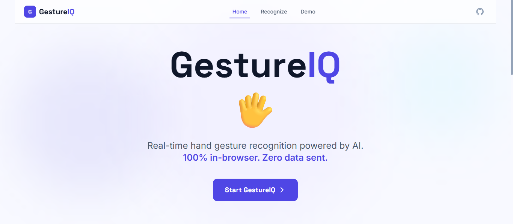
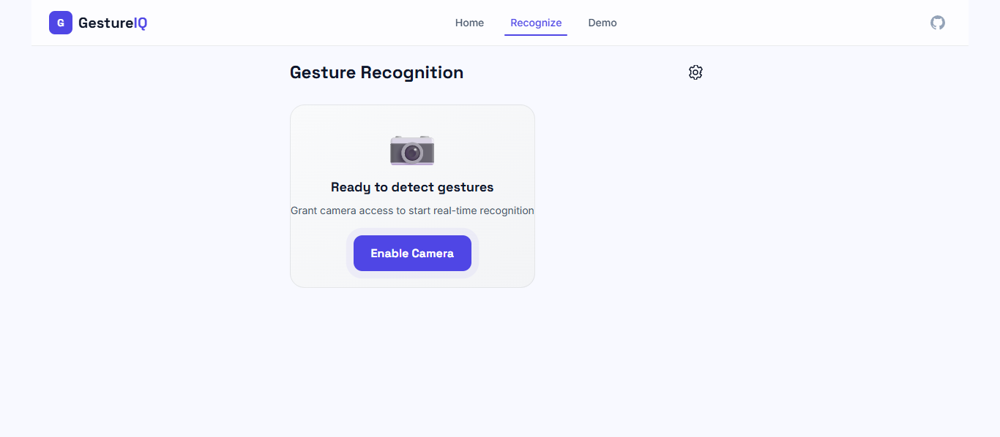
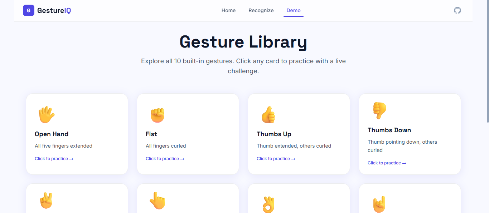

<div align="center">

<!-- LOGO / BANNER -->


<br/>

# 🖐️ GestureIQ

### Real-Time Hand Gesture Recognition — Right in Your Browser

**No downloads. No servers. No datasets. Just your hand.**

<br/>

[](https://gestureiq.web.app)
[](LICENSE)
[](PRD.md)
[](https://github.com/GairikBaidya/GestureIQ-real-time-hand-gesture-recognition-web-app/stargazers)
[](https://github.com/GairikBaidya/GestureIQ-real-time-hand-gesture-recognition-web-app/issues)

<br/>


</div>

---

## 🎬 Demo

<div align="center">

<!-- Replace with your actual screen recording GIF -->


> 👆 Live gesture detection with real-time skeleton overlay, confidence score, and spring animations — all running at 60 FPS in the browser.

</div>

---

## ✨ What is GestureIQ?

**GestureIQ** is a browser-based hand gesture recognition app powered by **Google MediaPipe Hands** and **TensorFlow.js-compatible landmark geometry**. Point your webcam at your hand and GestureIQ instantly identifies what gesture you're making — with a confidence score, an animated skeleton overlay, and a beautifully designed UI that makes the whole thing feel like a product, not a demo.

> 🔒 **100% private.** No video frames, no landmark data, nothing leaves your device. All inference runs client-side in your browser using WebAssembly.

---

## 🌟 Features

| Feature | Description |
|---|---|
| 🖐️ **10 Built-in Gestures** | Open Hand, Fist, Thumbs Up/Down, Peace, Point, OK, Rock On, Call Me, Three Fingers |
| ⚡ **Real-time Detection** | < 100ms latency at 24+ FPS on any modern laptop |
| 🦴 **Skeleton Overlay** | Animated cyan landmark skeleton drawn on live canvas |
| 📊 **Confidence Score** | Color-coded bar (🟢 lime / 🟡 amber / 🔴 coral) updates every frame |
| 🎨 **Gorgeous UI** | Bright modern design with glassmorphism panels and spring animations |
| 🎭 **Framer Motion** | Fluid page transitions, gesture name spring swaps, staggered card reveals |
| 🕹️ **Demo Mode** | Interactive gesture challenge mode with countdown ring and confetti 🎉 |
| ⚙️ **Settings Panel** | Adjustable model complexity, detection threshold, overlay toggle |
| 📱 **Mobile Ready** | Works on Chrome for Android and Safari iOS 15+ |
| ♿ **Accessible** | WCAG 2.1 AA, `prefers-reduced-motion` support, full keyboard navigation |
| 🔧 **Extensible** | Clean classifier architecture ready for custom gesture rules |

---

## 🖼️ Screenshots

<div align="center">

| Landing Page | Live Recognition | Demo Challenge |
|:---:|:---:|:---:|
|  |  |  |
| Animated hero + Lottie hand | Glassmorphism result panel | Countdown ring + confetti |

</div>

---

## 🖐️ Supported Gestures

<div align="center">

| # | Gesture | Emoji | How to Make It |
|---|---|:---:|---|
| 1 | Open Hand | 🖐️ | Spread all five fingers wide |
| 2 | Fist | ✊ | Curl all fingers into a fist |
| 3 | Thumbs Up | 👍 | Extend thumb, curl other fingers |
| 4 | Thumbs Down | 👎 | Point thumb downward, curl others |
| 5 | Peace / Victory | ✌️ | Index + middle fingers in a V |
| 6 | Point | 👆 | Index finger up, others curled |
| 7 | OK Sign | 👌 | Thumb and index form a circle |
| 8 | Rock On | 🤘 | Index and pinky extended |
| 9 | Call Me | 🤙 | Thumb and pinky extended |
| 10 | Three Fingers | 🤟 | Index, middle, ring extended |

</div>

> 🧠 **No ML model training required.** GestureIQ uses rule-based geometry on MediaPipe's 21 landmark points — pure math, instant results, zero dataset downloads.

---

## 🏗️ Tech Stack

### 🎨 Design & Build

| Tool | Purpose |
|---|---|
| 🎨 **Google Stitch MCP** | AI-powered UI design generation via MCP server |
| ⚡ **Google Antigravity** | AI-native cloud IDE used to build the entire project |
| 🐙 **GitHub Actions** | CI/CD — lint → test → deploy on every merge |
| 🔥 **Firebase Hosting** | Production deployment |

### 🖥️ Frontend Core

| Technology | Version | Role |
|---|---|---|
| ⚛️ React | 18.x | UI framework |
| 🔷 TypeScript | 5.x | Type safety |
| ⚡ Vite | 5.x | Build tool & dev server |
| 🎯 MediaPipe Hands | 0.4.x | 21-point hand landmark detection |
| 🎞️ Canvas API | native | Skeleton overlay rendering |
| 🌊 Tailwind CSS | 3.x | Utility-first styling |
| 🎭 Framer Motion | 11.x | Animations & transitions |
| 🐻 Zustand | 4.x | Global state management |
| 🛣️ React Router | 6.x | Client-side routing |

### 🧪 Testing

| Tool | Purpose |
|---|---|
| 🧪 Vitest | Unit & integration tests |
| 🎭 Playwright | End-to-end tests |
| 🧩 React Testing Library | Component tests |
| 🔮 MSW | API mocking |

---

## 🚀 Getting Started

### ✅ Prerequisites

- **Node.js** 20.x or higher
- **npm** 9.x or higher
- A device with a **webcam**
- A modern browser (Chrome 90+, Firefox 88+, Safari 15+, Edge 90+)
- **HTTPS** or `localhost` (required for `getUserMedia`)

---

### 📦 Installation

```bash
# 1. Clone the repository
git clone https://github.com/GairikBaidya/GestureIQ-real-time-hand-gesture-recognition-web-app.git
cd gestureiq

# 2. Install dependencies
npm install

# 3. Start the development server
npm run dev
```

Then open [http://localhost:5173](http://localhost:5173) in your browser. 🎉

---

### 🛠️ Available Scripts

```bash
# Start dev server with hot reload
npm run dev

# Type check (no emit)
npm run typecheck

# Lint the codebase
npm run lint

# Format with Prettier
npm run format

# Run unit tests (Vitest)
npm run test

# Run unit tests with UI
npm run test:ui

# Run end-to-end tests (Playwright)
npm run test:e2e

# Build for production
npm run build

# Preview production build locally
npm run preview
```

---

## 📁 Project Structure

```
gestureiq/
│
├── 📂 public/                     # Static assets
│   ├── favicon.ico
│   ├── og-image.png               # Social preview image
│   └── gesture-icons/             # SVG icons per gesture
│
├── 📂 design/                     # Google Stitch MCP exports
│   ├── stitch-exports/            # AI-generated design specs (JSON)
│   ├── tokens/design-tokens.json  # Color, spacing, type tokens
│   └── references/                # Reference screenshots
│
├── 📂 src/
│   ├── 📂 components/
│   │   ├── Camera/                # Webcam feed, selector, error, loader
│   │   ├── GestureDisplay/        # Label, confidence bar, history, panel
│   │   ├── LandmarkOverlay/       # Canvas skeleton drawing
│   │   ├── Settings/              # Slide-in settings drawer
│   │   ├── Demo/                  # Gesture cards, challenge, confetti
│   │   ├── Navigation/            # Navbar with animated indicator
│   │   ├── Landing/               # Hero, feature cards, how-it-works
│   │   └── ui/                    # Button, Badge, Card, GlassPanel...
│   │
│   ├── 📂 pages/
│   │   ├── LandingPage.tsx        # / — Hero + features
│   │   ├── RecognitionPage.tsx    # /app — Live gesture detection
│   │   ├── DemoPage.tsx           # /demo — Gesture challenges
│   │   └── CustomPage.tsx         # /custom — Custom gestures (Phase 2)
│   │
│   ├── 📂 hooks/
│   │   ├── useCamera.ts           # getUserMedia + device switching
│   │   ├── useMediaPipe.ts        # MediaPipe model + frame loop
│   │   ├── useGestureClassifier.ts# Landmark → gesture result
│   │   ├── useSettings.ts         # Settings store + localStorage
│   │   └── useReducedMotion.ts    # prefers-reduced-motion
│   │
│   ├── 📂 lib/
│   │   ├── mediapipe/             # Model init + frame processing
│   │   ├── classifier/            # GestureClassifier + 10 rules
│   │   └── drawing/               # Skeleton canvas utilities
│   │
│   ├── 📂 store/                  # Zustand stores
│   ├── 📂 constants/              # Gestures, animations, MediaPipe config
│   ├── 📂 types/                  # Shared TypeScript interfaces
│   └── 📂 styles/                 # Tailwind base, keyframes, fonts
│
├── 📂 tests/
│   ├── unit/                      # Classifier + hook unit tests
│   ├── integration/               # Component integration tests
│   └── e2e/                       # Playwright end-to-end tests
│
├── 📂 backend/                    # Optional backend (Phase 2)
├── 📂 ml/                         # Optional ML training (Phase 2)
└── 📂 .github/workflows/          # CI + deploy pipelines
```

---

## 🎨 UI Design System

GestureIQ's interface was designed using **Google Stitch MCP** — generating component specs and design tokens that were fed directly into the codebase.

### 🎨 Color Palette

<div align="center">

| | Token | Hex | Usage |
|:---:|---|---|---|
| 🟣 | `--color-accent-primary` | `#4F46E5` | Indigo — CTAs, active states |
| 🩵 | `--color-accent-electric` | `#6EE7F7` | Cyan — skeleton, detection glow |
| 🟢 | `--color-accent-lime` | `#A3E635` | Lime — high confidence, success |
| 🟡 | `--color-accent-amber` | `#FBBF24` | Amber — medium confidence |
| 🔴 | `--color-accent-coral` | `#F87171` | Coral — low confidence, errors |
| 💜 | `--color-accent-violet` | `#8B5CF6` | Violet — secondary highlights |

</div>

### 🔤 Typography

- **Space Grotesk** — branding, headings, gesture hero name (56px, weight 800)
- **Inter** — body text, labels, descriptions
- **JetBrains Mono** — code snippets, data values

### 🌟 Design Principles

- 🌅 **Bright light mode** — high contrast, electric accents on near-white `#F8F9FF`
- 🪟 **Glassmorphism panels** — `backdrop-filter: blur(16px)` on gesture result overlay
- ✨ **Every interaction has a micro-animation** — nothing is static
- 💫 **Spring physics** — `stiffness: 300, damping: 25` for natural-feeling motion
- ♿ **Motion safe** — all animations collapse to 0 duration on `prefers-reduced-motion`

---

## 🎭 Animation Highlights

| Interaction | Animation |
|---|---|
| Gesture name change | Spring scale swap via `key` remount (200ms) |
| Hand enters frame | Results panel slides in from right (spring) |
| Hand leaves frame | Panel fades out (300ms ease-out) |
| Confidence change | Badge spring bounces on threshold cross |
| Skeleton on first detect | `stroke-dashoffset` draw-on (400ms) |
| Landmark dots | Breathing pulse loop (1.5s) |
| Demo card hover | Lift `y: -4px` + deepen shadow |
| Challenge success | CSS confetti burst 🎉 + bounce |
| Settings open/close | Slide from right (350ms spring) |
| Nav active link | `layoutId` shared layout sliding underline |
| Page transitions | Fade + slide up between routes |

---

## 🧠 How It Works

```
                    ┌─────────────────────────────┐
                    │        Your Webcam           │
                    └────────────┬────────────────┘
                                 │ getUserMedia stream
                                 ▼
                    ┌─────────────────────────────┐
                    │    useCamera hook            │
                    │  (device selection, pause    │
                    │   on tab blur, error state)  │
                    └────────────┬────────────────┘
                                 │ video frames (rAF)
                                 ▼
                    ┌─────────────────────────────┐
                    │    useMediaPipe hook         │
                    │  MediaPipe Hands WASM Model  │
                    │  → 21 3D landmarks per hand  │
                    └──────┬───────────┬──────────┘
                           │           │
             landmarks     │           │  landmarks
                           ▼           ▼
              ┌────────────────┐  ┌─────────────────────┐
              │ LandmarkCanvas │  │ useGestureClassifier │
              │ cyan skeleton  │  │ 10 rule functions    │
              │ overlay drawn  │  │ geometry on coords   │
              └────────────────┘  └──────────┬──────────┘
                                             │ GestureResult
                                             ▼
                                  ┌─────────────────────┐
                                  │    gestureStore      │
                                  │    (Zustand)         │
                                  └──────────┬──────────┘
                                             │
                          ┌──────────────────┼──────────────────┐
                          ▼                  ▼                  ▼
               ┌─────────────────┐  ┌──────────────┐  ┌──────────────────┐
               │  GestureLabel   │  │ConfidenceBar │  │  GestureHistory  │
               │  56px spring    │  │ color badge  │  │ AnimatePresence  │
               │  name swap      │  │ + progress   │  │ last 5 gestures  │
               └─────────────────┘  └──────────────┘  └──────────────────┘
                     all inside GesturePanel (glassmorphism overlay)
```

> No datasets needed. No backend required. No model training. The gesture rules are pure TypeScript geometry — checking whether fingertips are above/below their knuckles, angles between landmark points, and relative tip positions.

---

## ⚙️ Configuration

All settings are accessible in the UI and persisted to `localStorage`. You can also configure them via the `AppSettings` interface:

```typescript
interface AppSettings {
  showOverlay: boolean;           // Toggle skeleton overlay
  showGestureLabel: boolean;      // Toggle gesture name display
  modelComplexity: 0 | 1 | 2;    // 0=Fast  1=Balanced  2=Accurate
  minDetectionConfidence: number; // 0.5 – 0.95, default 0.7
  minTrackingConfidence: number;  // 0.5 – 0.95, default 0.5
  maxNumHands: 1 | 2;            // Detect 1 or 2 hands
  cameraDeviceId: string | null;  // null = default camera
}
```

---

## 🧪 Testing

```bash
# Run all unit tests
npm run test

# Run with coverage report
npm run test:coverage

# Run Playwright e2e (requires running dev server)
npm run test:e2e

# Run specific test file
npm run test src/lib/classifier/GestureClassifier.test.ts
```

### Test Coverage Areas

- ✅ `GestureClassifier` — all 10 gesture rules
- ✅ `fingerUtils` — `isFingerExtended`, `angleBetween`, `tipAboveKnuckle`
- ✅ `useSettings` — store hydration from localStorage
- ✅ `RecognitionPage` — camera permission states
- ✅ `SettingsPanel` — open/close, value persistence
- ✅ E2E — gesture detection flow, demo challenge, confetti success

---

## 🌐 Browser Support

| Browser | Version | Status |
|---|---|:---:|
| Chrome | 90+ | ✅ Full support |
| Edge | 90+ | ✅ Full support |
| Firefox | 88+ | ✅ Full support |
| Safari | 15+ | ✅ Full support |
| Chrome Android | Latest | ✅ Full support |
| Safari iOS | 15+ | ✅ Full support |
| Opera | Latest | ✅ Full support |

> ⚠️ **Requires WebGL** for MediaPipe WASM GPU acceleration. HTTP is not supported — must use `localhost` or HTTPS.

---

## 📊 Performance

| Metric | Target | Status |
|---|---|:---:|
| Inference latency (P90) | < 100ms | ✅ |
| First Contentful Paint | < 1.5s | ✅ |
| Time to Interactive | < 3s (fast 3G) | ✅ |
| UI animation | 60 FPS | ✅ |
| Lighthouse Performance | ≥ 85 | ✅ |
| Lighthouse Accessibility | ≥ 90 | ✅ |
| Initial JS bundle (gzipped) | < 250KB | ✅ |

> 💡 The MediaPipe WASM model (~8MB) loads once and is cached by the browser on subsequent visits.

---

## 🗺️ Roadmap

### ✅ v1.0 — Current
- [x] 10 built-in gesture rules
- [x] MediaPipe Hands landmark detection
- [x] Animated skeleton overlay
- [x] Glassmorphism result panel
- [x] Demo challenge mode
- [x] Settings panel with persistence
- [x] Responsive design (desktop + mobile)

### 🚧 v2.0 — Coming Soon
- [ ] 🎨 Dark mode
- [ ] 🏆 Challenge streak / score system
- [ ] 🎙️ Custom gesture registration (train your own)
- [ ] 🤝 Two-hand multi-gesture combinations
- [ ] 🌐 Gesture-to-hotkey mapping
- [ ] 🔄 Export / import custom gesture profiles

### 🔮 Future Ideas
- [ ] 🤟 Sign language alphabet recognition
- [ ] 📱 React Native mobile app
- [ ] 🧩 Embeddable widget / npm package
- [ ] 🌍 i18n (gesture names in multiple languages)

---

## 🤝 Contributing

Contributions are welcome! Here's how to get started:

### 1. Fork and clone

```bash
git clone https://github.com/GairikBaidya/GestureIQ-real-time-hand-gesture-recognition-web-app.git
cd gestureiq
npm install
```

### 2. Create a feature branch

```bash
git checkout -b feat/your-feature-name
```

### 3. Make your changes

- Follow the existing code style (ESLint + Prettier configured)
- Write tests for any new classifier rules or hooks
- Update types if you add new interfaces

### 4. Run checks before pushing

```bash
npm run typecheck   # Must pass with zero errors
npm run lint        # Must pass with zero warnings
npm run test        # All tests must be green
```

### 5. Submit a Pull Request

Use a clear PR title. If you're adding a new gesture rule, include a short description of the geometry logic.

### 📋 Adding a New Gesture

1. Create `src/lib/classifier/rules/yourGesture.ts`
2. Export a function `(landmarks: NormalizedLandmark[]) => number` (returns confidence 0–1)
3. Register it in `GestureClassifier.ts`
4. Add the gesture to `src/constants/gestures.ts` with name + emoji
5. Add a test in `tests/unit/classifier/`

---

## 🧰 Built With

<div align="center">

| | Tool | Role |
|:---:|---|---|
| ⚛️ | [React 18](https://react.dev) | UI Framework |
| 🔷 | [TypeScript 5](https://www.typescriptlang.org) | Type Safety |
| ⚡ | [Vite 5](https://vitejs.dev) | Build Tool |
| 🎯 | [MediaPipe Hands](https://developers.google.com/mediapipe/solutions/vision/hand_landmarker) | Hand Detection |
| 🌊 | [Tailwind CSS 3](https://tailwindcss.com) | Styling |
| 🎭 | [Framer Motion 11](https://www.framer.com/motion/) | Animations |
| 🐻 | [Zustand 4](https://zustand-demo.pmnd.rs/) | State Management |
| 🛣️ | [React Router 6](https://reactrouter.com) | Routing |
| 🎨 | [Google Stitch MCP](https://stitch.withgoogle.com) | UI Design |
| ☁️ | [Google Antigravity](https://antigravity.google) | Cloud IDE |
| 🔥 | [Firebase Hosting](https://firebase.google.com/products/hosting) | Deployment |
| 🪨 | [Caveman](https://github.com/JuliusBrussee/caveman) | Token Optimization |

</div>

---

## 🔒 Privacy

GestureIQ takes privacy seriously:

- 🚫 **No video is recorded or transmitted** — ever
- 🚫 **No landmark data is sent to any server** in v1
- 🚫 **No analytics** that include biometric data
- ✅ **Camera pauses automatically** when the browser tab loses focus
- ✅ **All processing happens locally** on your device using WebAssembly
- ✅ **No account required** — open the app and it works

---

## 📄 License

This project is licensed under the **MIT License** — see the [LICENSE](LICENSE) file for details.

```
MIT License — Copyright (c) 2026 [Your Name]

Permission is hereby granted, free of charge, to any person obtaining a copy
of this software and associated documentation files...
```

---

## 🙏 Acknowledgements

- 🙌 [Google MediaPipe](https://mediapipe.dev) — for the incredible real-time hand landmark model
- 🎭 [Framer Motion](https://www.framer.com/motion/) — for making animations feel alive and easy
- 🎨 [Google Stitch MCP](https://stitch.withgoogle.com) — for AI-powered UI design generation
- ⚡ [Google Antigravity](https://antigravity.google) — for the AI-native development environment
- 🪨 [Julius Brussee / Caveman](https://github.com/JuliusBrussee/caveman) — for slashing token usage during development
- 🐻 [Zustand](https://github.com/pmndrs/zustand) — for the cleanest state management in React
- 💡 Inspired by the amazing open-source computer vision community

---

## 👤 Author

<div align="center">

**Gairik Baidya**

[](https://github.com/GairikBaidya)
[](https://www.linkedin.com/in/gairikbaidya/)
[](https://yourportfolio.dev)

</div>

---

<div align="center">

**If GestureIQ helped you or impressed you, please consider giving it a ⭐**

*It helps others find the project and keeps the motivation going!*

<br/>


**Made with ❤️, React, and way too many hand gestures**

</div>
